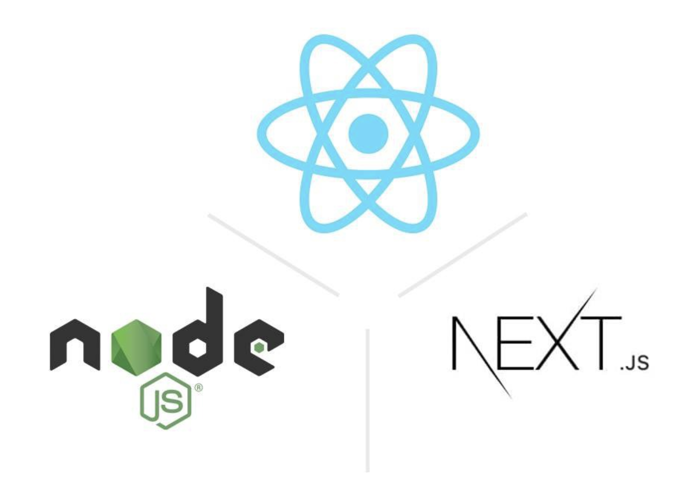
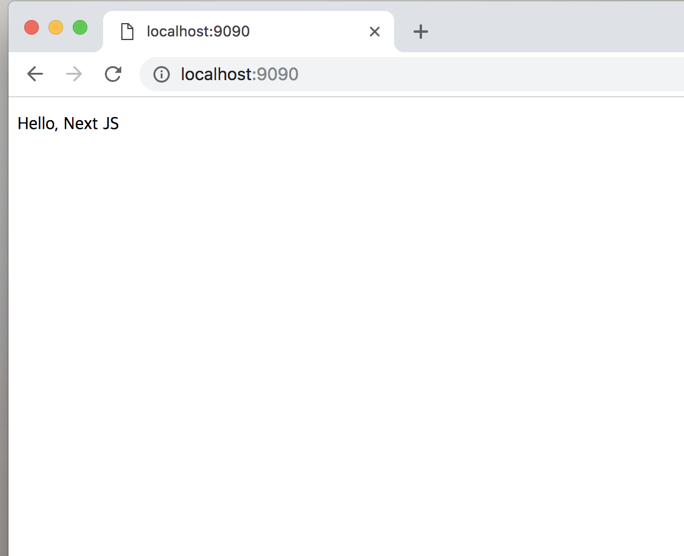

# NEXT JS 시작하며...
> 그 동안 웹 개발을 하면서, 늘 쫒아 다녔던 고민과 질문은 프론트 개발자 이냐 아니면 백 엔드 개발자냐 라는 질문이고, 스스로도 프론트 개발을 해야할 지 백엔드 개발을 해야할지 항상 고민을 하며 직업으로써의 일을 해 왔습니다.
아직도 고민을 하고있습니다. 어떤 멋진 데이터를 수초 안에 불러온다고 해도 사용자가 편하고 쉽게 볼 수 있는 화면이 없다면, 또는 화면을 멋있게 만들어도 이 안에 표현해야 할 데이터가 지저분하거나 속도가 느리다면 결국은 둘 다 중요하다라는 것이
지금으로써의 결론입니다. 최근 주변 개발자 들 사이에서 JS 웹 프레임워크로 무엇을 쓸 지 물어보면, 고민을 많이 하는 것을 볼 수 있었습니다. 몇 년 전까지는 선택이였지면, 앞으로는 필수적인 부분이 된게 사실입니다.(불과 3 ~ 4년 전까지만 해도 취업사이트에서도
JQuery를 사용할 줄 아는지가 전부였...)

---

## NEXT JS 란?
> 2016년 10월에 Zeit.co 팀에 의해 발표된 React JS를 이용한 서버 사이드 렌더링 프레임워크 (SSR)

### React JS란?
```
Facebook이 만들고 있는 이른바 MVC 프레임워크에서의 뷰 부분을 컴포넌트로 만들기 위한
라이브러리입니다. (자세한 특징과 내용은 다시 알아보도록 하겠습니다.)
```

### SSR 이란?
```
- Server Side Rendering
- SEO(Search Engine Optimization: 검색 엔진 최적화)에 유리하다
- View 초기 로딩 속도가 빠르다.
- View를 서버에서 부터 렌더링하여 가져오기 때문에 서버에 부담을 준다.
```

### CSR 이란?  (SSR과 비교되는 개념)
```
- Client Side Rendering
- SSR보다는 비교적 느리다.
- HTML과 자바스크립트 등 각종 리소스를 다운 받은 후 브라우저에서 렌더링한다.
```
### SSR과 CSR의 비교
```
SSR과 CSR의 차이점은 View를 Server에서 아니면 Client 에서 생성하는 차이와,
검색엔진 최적화의 문제가 있습니다.
```

## 따라서
React JS 라이브러리를 핵심으로 한 NEXT JS 프레임워크를 이용해서 처음 페이지를 요청할 때에는 서버 사이트 렌더링을 하고,
그 이후에는 내부에서 페이지가 이동될 때 데이터를 가져와서 페이지를 브라우저에서 렌더링하여 SSR과 CSR의 장점을 모두 취합니다.

---
## 기본 사용 방법
### 설치
1. 기본적으로 Node JS, NPM or Yarn 설치
   * Node JS & NPM 설치(https://nodejs.org/ko/download/package-manager/)
   * Yarn 설치(https://yarnpkg.com/lang/en/docs/install/#mac-stable)

2. 프로젝트 디렉터리 생성 및 next & react & react-dom 설치

- NPM

```
mkdir [프로젝트 디렉토리]
cd [프로젝트 디렉토리]
npm init
npm install --save next react react-dom
mkdir pages
```

- Yarn

```
mkdir [프로젝트 디렉토리]
cd [프로젝트 디렉토리]
yarn init -y
yarn add next react react-dom
mkdir pages
```
**이후 npm으로 진행하도록 하겠습니다**
> **제약사항** NEXT JS에서는 각 route 에 해당된 파일은 반드시 pages라는 디렉토리 안에 들어가야 하기 때문에 pages 디렉터리를 반드시 생성, 다른 디렉토리는 자유롭게 생성 가능합니다.

3. package.json에 Script 편집

```
{
  "name": "hello-next",
  "version": "1.0.0",
  "description": "",
  "main": "index.js",
  "scripts": {
    "dev": "next -p 9090",
    "build": "next build",
    "start": "next start"
  },
  "author": "",
  "license": "ISC",
  "dependencies": {
    "axios": "^0.18.0",
    "next": "^7.0.2",
    "react": "^16.6.3",
    "react-dom": "^16.6.3"
  }
}
```

4. pages디렉터리에 index.js 파일 생성(**기본 ES6문법으로 작성**)
```
const Index = () => (
    <div>
        <p>Hello, Next JS </p>
    </div>
);

export default Index
```

5. Terminal에서 실행
```
$npm run dev

> hello-next@1.0.0 dev /project/hello-next
> next -p 9090

✔ success server compiled in 178ms
✔ success client compiled in 886ms
...
```

6. package.json 에 script에 dev를 보시면 -p [포트] 옵션으로 9090이기 때문에 http://localhost:9090 으로 접속하시면 됩니다.



7. 내용 수정

*  **Hot Module Replacement** 가 적용되어있어서 파일을 수정해도 페이지를 리로딩하지 않고 변화를 감지해 즉시 적용하여 브라우저가 자동으로 갱신됩니다.

### Next
* NEXT JS의 기본 라이브러리인 React JS에 대해 좀더 자세히 살펴보도록 하겠습니다.
* NEXT JS의 기본 구조에 대해 설명해보도록 하겠습니다.
