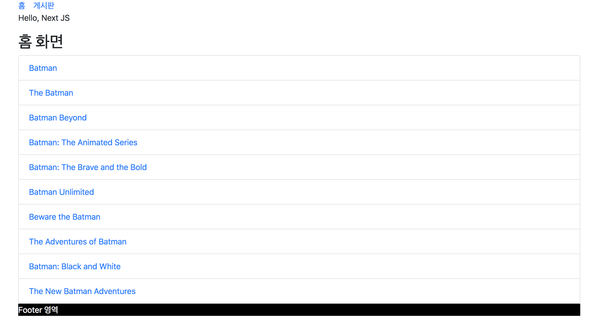

# NEXT JS - 배포하기
> NEXT JS 프레임웍을 이용하여 진행한 프로젝트를 `ZEIT/now` 서비스을 사용하여 배포 하고자 합니다.

## SeverLess 배포가 가능한 Now 란?
> ZEIT Now는 서버가없는 배치를위한 클라우드 플랫폼입니다. 이를 통해 개발자는 최소한의 구성만으로 즉시 배포하고 자동으로 확장하며 감독이 필요없는 웹 사이트 및 웹 서비스를 호스팅 할 수 있습니다


[공식사이트](https://zeit.co/docs/v2/getting-started/introduction-to-now/)

#### 특징

**NOW 에서 지원하는 런타임, 프레임웍, 언어**

* Static site generators
* Node.js
* Go
* Python
* React server-rendering with Next.js


**별도의 시스템이 필요없이 `now CLI`를 통해 API 호출또는 Now + GitHub 사용하여 코드 실생됩니다**

**NOW의 기본 프로토볼은 443입니다.**


## 배포하기 

####1. 터미널에서 `now` 진행하기
> next 를 설치하여 지금까지 진항한 프로젝트 위치의 터미널에서 다음과 같이 실행합니다.

```
$ now
> UPDATE AVAILABLE The latest version of Now CLI is 12.1.14
> Read more about how to update here: https://zeit.co/update-cli
> Changelog: https://github.com/zeit/now-cli/releases/tag/12.1.14
> No existing credentials found. Please log in:
> We sent an email to [이메일]. Please follow the steps provided
  inside it and make sure the security code matches Classical Sponge.
✔ Email confirmed
> Ready! Authentication token and personal details saved in "~/.now"
```

`확인` 처음 `now`를 실행하면 이메일 등록 하라는 내용이 나옵니다. 이메일을 등록 하면, 발신자 `ZEIT`에게 확인 메일 한 통이 오고, 메일에서 `VERIFY`를 클릭하면,
일단 준비는 완료 됩니다.

####2. `/now.json` 피일 생성 후 다음과 같이 입력합니다.

```
{
  "version": 1,
  "name": "nextjs-starter",
  "alias": ["nextjs-starter.now.sh"]
}
```

####3. 다시 터미널에서 `$ now`를 실행시켜 줍니다.

```
$ now
> UPDATE AVAILABLE The latest version of Now CLI is 12.1.14
> Read more about how to update here: https://zeit.co/update-cli
> Changelog: https://github.com/zeit/now-cli/releases/tag/12.1.14
> WARN! You are using an old version of the Now Platform. More: https://zeit.co/docs/v1-upgrade
> Deploying ~/Project/next under next@next.com
> Synced 2 files (28.38KB) [2s]
> Using Node.js 8.11.3 (default)
> https://프로젝트명-bebdqanxhf.now.sh [v1] [in clipboard] (sfo1) [2s]
> Building…
> ▲ npm install
>
> added 760 packages in 9.473s
> ▲ npm run build
> 
> next @1.0.0 build /home/nowuser/src
> next build
> 
> [08:13:02] Compiling client
> [08:13:02] Compiling server
> [08:13:04] Compiled server in 2s
> [08:13:08] Compiled client in 5s
> ▲ Snapshotting deployment
> ▲ Saving deployment image (13.9M)
> Build completed
> Verifying instantiation in sfo1
> [0] 
> [0] next@1.0.0 start /home/nowuser/src
> [0] next start
> [0] 
> [0] Ready on http://localhost:3000
> ✔ Scaled 1 instance in sfo1 [40s]
> Success! Deployment ready


```
> 무언가 진행이 되었고, 완료 되었다는 내용이 있습니다

####4. 터미널 결과 중간에 `https://프로젝트명-bebdqanxhf.now.sh [v1]`가 보입니다. 해당 URL을 연결합니다.



> 로컬에서 돌아가는 프로젝트가 원격에 배포되어 위와 같이 출력됩니다. 


##AWS - Elastic Beanstalk 에 배포하기
> `ZEIT/now'서비스 를 이용하면 배포가 너무 쉽습니다. 하지만 AWS의 Elastic Beanstalk 에 배포하고 자 할 경우 몇 가지를 수정하고 신경써야 합니다.

####1. `/package.json` 내용을 수정 합니다.

```

//package.json 
"scripts": {
    "dev": "node server.js",
    "build": "next build",
    "start": "NODE_ENV=production node server.js"
  }

``` 

####2. NEXT JS 프레임웍은 반드시 `next build`과정을 거쳐야 함으로, `/.next` 와 `/node_module`까지 압축하여 배포 합니다.

####3. `/.npmrc` 파일을 추가하여 계정에 대한 권한을 체크합니다.

```
//빌드 시 permission denied 된다면 다음 내용을 추가
unsafe-perm=true
```

####4. `/.ebextensions` 디렉터리 생성 후 `00_dir_permission.config` 파일을 생성한다.

```
//-/.ebextensions/00_dir_permission.config

files:
  "/opt/elasticbeanstalk/hooks/appdeploy/post/00_set_tmp_permissions.sh":
    mode: "000755"
    owner: root
    group: root
    content: |
      #!/usr/bin/env bash
      chown -R nodejs:nodejs /tmp
```

####5. Elastic Beanstalk에 NGINX는 http 80포트를 통해 기본 포트 8081로 전달 되기 때문에 `server.js`파일에 포트를 수정합니다.

```
//server.js
const express = require('express');
const next = require('next');

const dev = process.env.NODE_ENV !== 'production';
const app = next({dev});
const handle = app.getRequestHandler();

app.prepare()
.then(()=>{
    const server = express();

    server.get('/board/:title', (req, res) => {
        const page = '/boardView';
        const params = {title: req.params.title}
        app.render(req, res, page, params)
    });

    server.get('*', (req, res) => {
        return handle(req, res)
    });

    server.listen(8081, (err) => {
        if(err) throw err;
        console.log("> Ready on Server Port: 8081")
    })
})
.catch((ex) => {
    console.error(ex.stack);
    process.exit(1);
})
```