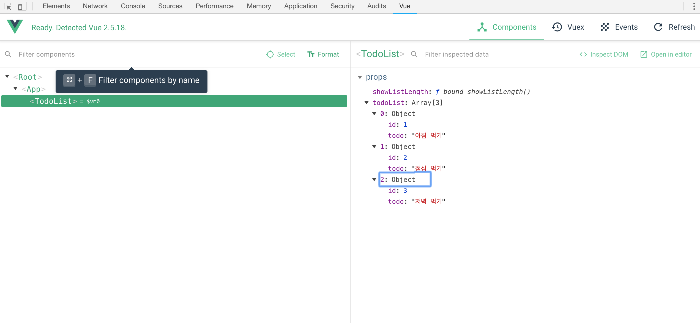

## component란 무엇인가요?
VueJs로 만들어지는 어플리케이션을 하나의 큰 덩어리라고 생각해보죠.  
그럼 이 큰 덩어리를 구성하기 위해서는 작은 덩어리들이 뭉쳐야합니다.  
이렇게 작은 덩어리들을 하나의 component로 생각할 수 있습니다.  
component를 나누는 기준은 한가지 일을 잘 수행하는 component가 되면 됩니다.  
그럼 이 모든 component가 모여서 하나의 어플리케이션을 완성할 수 있는데 컴포넌트를 사용함에 있어서 몇 가지 주의사항이 있습니다.  
이것은 직접 만들어보면서 얘기해보도록 하겠습니다.
우선 components 폴더에 TodoList.vue라는 파일을 만들고 아래와 같이 작성합니다.

```html
<template>
    <div class="mainTable">
        <table class="table">
            <thead>
            <tr>
                <th>인덱스</th>
                <th>순번</th>
                <th>오늘의 할일</th>
            </tr>
            </thead>
            <tbody>
            <tr v-for="(item, index) in todoList" :key="item.id">
                <td v-if="index === 0">인덱스가 0이면 출력</td>
                <td v-else-if="index ===1">인덱스가 1이면 출력</td>
                <td v-else>인덱스가 0도 1도 아니면 출력</td>
                <td>{{item.id}}</td>
                <td>{{item.todo}}</td>
            </tr>
            </tbody>
        </table>
    </div>
</template>

<script>
  export default {
    name: 'TodoList',
    props: {
      todoList: Array
    }
  }
</script>

<!-- Add "scoped" attribute to limit CSS to this component only -->
<style scoped>
    .mainTitle {
        padding: 15px;
    }
    .mainTable {
        width: 50%;
        margin: auto;
    }
</style>

```

위 코드를 보면 아시겠지만 기존에 App.vue 파일에 있는 리스트만 떼서 가져왔습니다.
그럼 위 component를 App.vue 컴포넌트에 넣어줘야겠죠?

```html
<template>
    <div id="app">
        <div class="mainTitle">
            <h2>VueJs로 만드는 todoList</h2>
        </div>
        <todo-list :todoList="todoList"></todo-list>
    </div>
</template>

<script>

import TodoList from './components/TodoList'

export default {
  name: 'app',
  components: {
    TodoList
  },
  data() {
    return {
      todoList: [
        {id: 1, todo: '아침 먹기'},
        {id: 2, todo: '점심 먹기'},
        {id: 3, todo: '저녁 먹기'}
      ]
    }
  }
}
</script>

<style>
</style>

```

이제 다시 한 번 화면을 확인해보시면 결과가 같음을 알 수 있습니다.  
App.vue 페이지에서 TodoList 컴포넌트를 import해서 정의해주고 이를 원하는 위치에 html태그로 사용하여 표시해주었는데요. 
여기서 컴포넌트 이름을 정의할 때는 되도록 짧고 의미있는 단어들로 작성해 주시는게 좋습니다. 
그리고 태그안에 무엇인가 추가되었죠?  
그건 바로 자식 컴포넌트(TodoList)에게 부모 컴포넌트(App.vue)가 데이터를 전달하는 방법입니다.  
저렇게 보내진 데이터는 자식 컴포넌트에서 props로 받을 수 있고 사용할 수 있습니다. 여기서 주의할 점은 부모가 보내준 데이터는 자식 컴포넌트에서 바로 수정할 수 없어요.  
그래서 수정하려면 부모가 내려주는 메소드를 통해서 데이터를 수정할 수 있답니다.
그럼 우선 메소드를 사용하는 방법부터 알아볼까요?

```html
<template>
    <div id="app">
        <div class="mainTitle">
            <h2>VueJs로 만드는 todoList</h2>
        </div>
        <div>
            <div style="height: 50px; width: 100%">
                <button class="btn-dark float-right" style="margin-right: 150px;" @click="showListLength">총 개수</button>
            </div>
            <todo-list :todoList="todoList"></todo-list>
        </div>
    </div>
</template>

<script>

import TodoList from './components/TodoList'

export default {
  name: 'app',
  components: {
    TodoList
  },
  data() {
    return {
      todoList: [
        {id: 1, todo: '아침 먹기'},
        {id: 2, todo: '점심 먹기'},
        {id: 3, todo: '저녁 먹기'}
      ]
    }
  },
  methods: {
    showListLength() {
      const length = this.todoList.length
      alert(length)
    }
  }
}
</script>

<style>
</style>

```

App.vue component에서 메소드를 사용할 수 있는 버튼을 추가했습니다.
바로 느낌이 오셨을 거 같은데요. @click을 통해서 클릭이벤트를 실행시킬 수 있고 따옴표 안에는 실행시킬 메소드 이름을 기입하면 됩니다.
@click은 v-on:click의 약어입니다. 간편히 @이만 쓰는게 더 좋죠? 그리고 @를 통해서 keyup.enter, submit 등의 이벤트를 사용할 수 있습니다.   
그리고 스크립트에 보시면 methods가 추가되었죠? 그 안에 showListLength라는 메소드를 정의하고 현재 리스트의 개수를 alert로 알려주는 함수를 추가했습니다.  
여기서 컴포넌트에 정의된 데이터를 접근할 때 this를 이용하면 간단히 불러올 수 있어요.
수정이 완료되었다면 화면에서 버튼을 클릭해보세요!  
alert창이 리스트의 개수를 알려줄겁니다.  

그럼 이제 이 메소드를 자식 컴포넌트에게 전달해보까요?

```html
// App.vue
<template>
    <div id="app">
        <div class="mainTitle">
            <h2>VueJs로 만드는 todoList</h2>
        </div>
        <todo-list :todoList="todoList" :showListLength="showListLength"></todo-list>
    </div>
</template>

<script>

import TodoList from './components/TodoList'

export default {
  name: 'app',
  components: {
    TodoList
  },
  data() {
    return {
      todoList: [
        {id: 1, todo: '아침 먹기'},
        {id: 2, todo: '점심 먹기'},
        {id: 3, todo: '저녁 먹기'}
      ]
    }
  },
  methods: {
    showListLength() {
      const length = this.todoList.length
      alert(length)
    }
  }
}
</script>

<style>
</style>

// TodoList.vue
<template>
    <div>
        <div style="height: 50px; width: 100%">
            <button class="btn-dark float-right" style="margin-right: 150px;" @click="showListLength">총 개수</button>
        </div>
        <div class="mainTable">
            <table class="table">
                <thead>
                <tr>
                    <th>인덱스</th>
                    <th>순번</th>
                    <th>오늘의 할일</th>
                </tr>
                </thead>
                <tbody>
                <tr v-for="(item, index) in todoList" :key="item.id">
                    <td v-if="index === 0">인덱스가 0이면 출력</td>
                    <td v-else-if="index ===1">인덱스가 1이면 출력</td>
                    <td v-else>인덱스가 0도 1도 아니면 출력</td>
                    <td>{{item.id}}</td>
                    <td>{{item.todo}}</td>
                </tr>
                </tbody>
            </table>
        </div>
    </div>
</template>

<script>
  export default {
    name: 'TodoList',
    props: {
      todoList: Array,
      showListLength: Function
    }
  }
</script>

<!-- Add "scoped" attribute to limit CSS to this component only -->
<style scoped>
    .mainTitle {
        padding: 15px;
    }
    .mainTable {
        width: 50%;
        margin: auto;
    }
</style>

```

엄청 간단하죠?  
부모 컴포넌트에서 데이터를 전달하는 방법과 똑같은 방식으로 자식 컴포넌트에게 메소드를 전달하고 자식 컴포넌트에서도 마찬가지로 props로 메소드를 받았습니다.  
부모 컴포넌트에 있던 버튼을 자식 컴포넌트로 가져오면 끝입니다.  
이제 자식 컴포넌트에서 부모 컴포넌트에 있는 메소드를 실행할 수 있어요.  
이 메소드를 이용하면 내려받았던 데이터를 수정하는데는 전혀 문제가 없겠죠?

이번엔 컴포넌트 네임과 DevTool을 사용하는 방법에 대해 말해보겠습니다.  
컴포넌트안에 name으로 각 컴포넌트의 네임을 정의하고 있습니다.  
이렇게 정의한 이름들은 개발과 테스트에 용이하니 잊지말고 꼭 써주시기 바랍니다.
우선 [VUE.JS DEVTOOLS](https://chrome.google.com/webstore/detail/vuejs-devtools/nhdogjmejiglipccpnnnanhbledajbpd?hl=en)을 다운받아 볼게요.(크롬 기준으로 설명드립니다.)  
그리고 저희가 만들고 있었던 웹페이지로 이동해서 개발자 도구를 켜주시고 우측 상단에 보시면 vue라는 탭이 생성된 결 확인할 수 있습니다.

     

모두 보이시나요?  
그럼 위 사진처럼 명명했던 컴포넌트들이 있고 그 컴포넌트를 클릭하면 우측에서 각 컴포넌트들의 data 또는 props를 확인할 수 있습니다.  
그 이외에도 개발을 하시다 보면 다양한 상태값에 대해 확인이 가능하니 개발하실 때는 꼭 사용하시길 권장드립니다.
