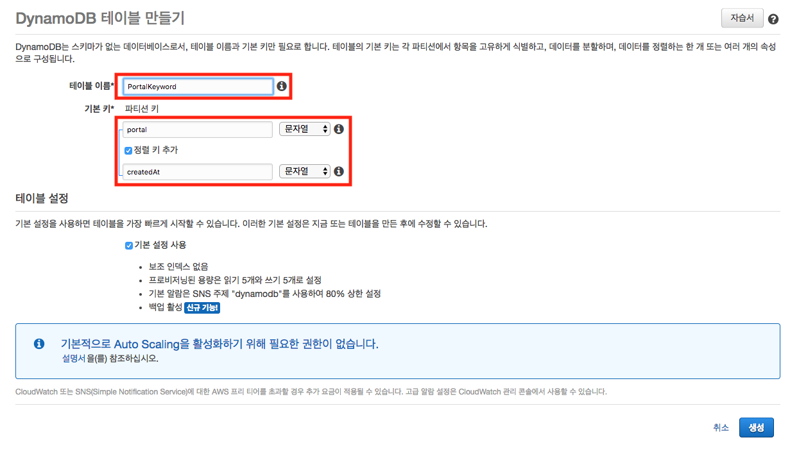

> 본 포스팅은 2018년 9월 29일과 12월 1일에 진행된 김승호님의 "Python Serverless" 코드랩에서 사용되었던 자료입니다. 


## DynamoDB 테이블 생성하기

DynamoDB를 설계할 시 주의해야할 점은 [FAQ](https://aws.amazon.com/ko/dynamodb/faqs/)를 참고하시길 바랍니다.

이제 DynamoDB에 Todo table을 생성할 것입니다. 파티션 키와 정렬 키는 다음과 같이 설정합니다.

- 파티션키(Partition Key): portal
- 정렬키(Sort Key): createdAt

그럼 [DynamoDB Console](https://ap-northeast-2.console.aws.amazon.com/dynamodb/home?region=ap-northeast-2#)로 이동합니다.
테이블 만들기를 클릭하여 아래와 같이 테이블을 생성합니다.




## Python 크롤링 시작하기

파일 트리는 다음과 같습니다.

```txt
environment
└── serverless-crawler  : Crawler
    ├── crawler.py  : Lambda에서 trigger하기 위한 handler가 포한됨 파일
    ├── lambda_test.py: lambda function test
    ├── zappa_settings.json : Zappa config file
    └── requirements.txt : 개발을 위하 필요한 library 정보
```

먼저 터미널을 열어 serverless-crawler 디렉터리를 생성하고 각 파일들을 편집합니다.

```sh
(venv) ec2-user:~/environment $ mkdir serverless-crawler && cd serverless-crawler
```


### serverless-crawler/requirements.txt

```txt
beautifulsoup4==4.6.3
pynamodb==3.3.1
zappa==0.46.2
```

python은 requirements.txt 에 개발에 필요한 라이브러리를 기술합니다.

사용하는 라이브러리는 다음과 같습니다.

- beautifulsoup4: python web scrape 라이브러리
- pynamodb: DynamoDB를 사용하기 쉽도록 Modeling하는 도구
- zappa: python serverless framework

requirements.txt에 있는 라이브러리들을 설치 합니다.

```sh
(venv) ec2-user:~/environment/serverless-crawler $ pip install -r requirements.txt

```


### serverless-crawler/zappa_settings.json

zappa 를 init 하면 zappa_settings.json 파일이 생성됩니다.

```sh
(venv) ec2-user:~/environment/serverless-crawler $ zappa init
...
What do you want to call this environment (default 'dev'): dev
...
What do you want to call your bucket? (default 'zappa-gpz692isv'): 아무것도 입력하지 않음
...
Where is your app's function?: crawler
...
Would you like to deploy this application globally? (default 'n') [y/n/(p)rimary]: n
...
Does this look okay? (default 'y') [y/n]: y
...
```

**zappa_settings.json** 을 아래처럼 변경하여 저장합니다.

```json
{
    "dev": {
        "aws_region": "ap-northeast-2",
        "profile_name": "default",
        "project_name": "python-serverless-crawler",
        "runtime": "python3.6",
        "s3_bucket": "ZAPPA_GENERATED_S3_BUCKET",

        "apigateway_enabled": false,
        "keep_warm": false,
        "lambda_description": "Python Serverless Crawler",
        "lambda_handler": "crawler.lambda_handler",
        "memory_size": 128
    }
}
```


### serverless-crawler/crawler.py

```python
import datetime
import requests
from bs4 import BeautifulSoup
from pynamodb.models import Model
from pynamodb.attributes import UnicodeAttribute, ListAttribute


class PortalKeyword(Model):
    """
    A DynamoDB Keyword
    """
    class Meta:
        table_name = "PortalKeyword"
        region = 'ap-northeast-2'

    portal = UnicodeAttribute(hash_key=True)
    createdAt = UnicodeAttribute(range_key=True)
    keywords = ListAttribute()


def naver_keywords_crawler():
    created_at = datetime.datetime.utcnow().isoformat()[:19]
    naver_keywords = []

    try:
        naver_resp = requests.get('https://www.naver.com/')
        naver_soup = BeautifulSoup(naver_resp.text, 'html.parser')

        for i, tag in enumerate(naver_soup.find_all('span', {'class':'ah_k'})[:20]):
            rank = i+1
            keyword = tag.get_text()

            naver_keywords.append({'rank': rank, 'keyword': keyword})

        keyword_item = PortalKeyword('naver', created_at)
        keyword_item.keywords = naver_keywords
        keyword_item.save()

    except Exception as e:
        print(e)
        return None

    return naver_keywords


def daum_keywords_crawler():
    created_at = datetime.datetime.utcnow().isoformat()[:19]
    daum_keywords = []

    try:
        # daum 의 실시간 검색어 크롤러를 작성해 보세요.
        return True

    except Exception as e:
        print(e)
        return None

    return daum_keywords


def lambda_handler(event, context):

    naver_result = naver_keywords_crawler()
    daum_result = daum_keywords_crawler()

    # print(naver_result)
    # print(daum_result)

    if naver_result and daum_result:
        return 'success'
    else:
        return 'error'

```


### serverless-crawler/lambda_test.py

```python
from crawler import lambda_handler

print(lambda_handler(None, None))
```

터미널에서 테스트 코드를 실행시켜 봅니다.

```sh
(venv) ec2-user:~/environment/serverless-crawler $ python lambda_test.py
success
```

[DynamoDB Console](https://ap-northeast-2.console.aws.amazon.com/dynamodb/home?region=ap-northeast-2#tables:selected=PortalKeyword)에 들어가서 성공적으로 항목들이 생성되었는지 확인합니다.


## Cloud9에서 배포하기

### Zappa deploy

```sh
(venv) ec2-user:~/environment/serverless-crawler $ zappa deploy dev
Calling deploy for stage dev..
Downloading and installing dependencies..
 - sqlite==python36: Using precompiled lambda package
Packaging project as zip.
Uploading python-serverless-crawler-dev-1538136485.zip (5.8MiB)..
100%|██████████████████████████████████████████████████████████████████████████████████████████████████████████████████████████████████████████████████████████████████████████████████████████████████████| 6.13M/6.13M [00:01<00:00, 3.48MB/s]
Deployment complete!
(venv) ec2-user:~/environment/serverless-crawler $
```

정상적으로 deploy 되었으면, [Lambda Console](https://ap-northeast-2.console.aws.amazon.com/lambda/home?region=ap-northeast-2#/functions) 에서 새로 생성된 `python-serverless-crawler-dev` 함수를 확인 할 수 있습니다.


### Zappa invoke

invoke 를 해봅니다.

```sh
(venv) ec2-user:~/environment/serverless-crawler $ zappa invoke dev
Calling invoke for stage dev..
[START] RequestId: XXXXXXX-.... Version: $LATEST
[END] RequestId: XXXXXXX-....
[REPORT] RequestId: XXXXXXX-....
Duration: 2274.70 ms
Billed Duration: 2300 ms
Memory Size: 128 MB
Max Memory Used: 47 MB
```


### Zappa update

주기적으로 크롤링 하도록 함수를 update 를 해봅니다.

`zappa_settings.json` 에서 events 를 추가합니다.

**serverless-crawler/zappa_settings.json**

```json
{
    "dev": {
        ...
        "apigateway_enabled": false,
        "events": [
            {
                "function": "crawler.lambda_handler",
                "expression": "rate(10 minutes)"
            }
        ],
        ...
    }
}
```

```sh
(venv) ec2-user:~/environment/serverless-crawler $ zappa update dev
Calling update for stage dev..
Downloading and installing dependencies..
 - sqlite==python36: Using precompiled lambda package
Packaging project as zip.
Uploading python-serverless-crawler-dev-1538137619.zip (5.8MiB)..
100%|██████████████████████████████████████████████████████████████████████████████████████████████████████████████████████████████████████████████████████████████████████████████████████████████████████| 6.13M/6.13M [00:01<00:00, 3.51MB/s]
Updating Lambda function code..
Updating Lambda function configuration..
Scheduling..
Scheduled python-serverless-crawler-dev-crawler.lambda_handler with expression rate(10 minutes)!
Your updated Zappa deployment is live!
```

성공적으로 update 되었습니다.
지금부터 10분마다 주기적으로 DynamoDB에 검색어 랭킹이 쌓입니다.


## 리소스 삭제하기

서버리스 앱은 내리는 것이 어렵지 않습니다.
간단한 Command 하나면 모든 스택이 내려갑니다.
Cloud9에서 새로운 터미널을 열고 다음과 같이 입력합니다.

```sh
(venv) ec2-user:~/environment/serverless-crawler $ zappa undeploy dev
Calling undeploy for stage dev..
Are you sure you want to undeploy? [y/n] y
Unscheduling..
Unscheduled python-serverless-crawler-dev-crawler.lambda_handler.
Deleting Lambda function..
Done!
```

[IAM Console](https://console.aws.amazon.com/iam/home#/users)로 들어가서 오늘 생성한 관리자 사용자(python-serverless)를 삭제합니다.

[S3 Console](https://s3.console.aws.amazon.com/s3/home?region=ap-northeast-2)로 들어가서 Zappa가 생성한 버킷(zappa-XXXXXXXX)을 삭제합니다.

[DynamoDB Console](https://ap-northeast-2.console.aws.amazon.com/dynamodb/home?region=ap-northeast-2)로 들어가서 Table을 삭제합니다. 리전은 서울입니다.

[Cloud9 Console](https://ap-southeast-1.console.aws.amazon.com/cloud9/home?region=ap-southeast-1)로 들어가서 IDE를 삭제합니다. 리전은 싱가포르입니다.


## References

- [https://aws.amazon.com/ko/cloud9/](https://aws.amazon.com/ko/cloud9/)
- [https://www.zappa.io/](https://www.zappa.io/)
- [https://www.crummy.com/software/BeautifulSoup/bs4/doc/](https://www.crummy.com/software/BeautifulSoup/bs4/doc/)
- [https://pynamodb.readthedocs.io](https://pynamodb.readthedocs.io)

